# Architecture-Diagram.md — Genius-x

Derived from `CONTEXT.md`, the passed `README.md`, and `REDALE.md`. One
primary `flowchart`; no `sequenceDiagram` is added because the happy path's
ordering is already carried by the numbered edge labels below.

## Legend

| Meaning | Style |
|---|---|
| Primary happy path (Main Flow 4 — LLM-assisted investigation with guardrail) | thick gold nodes/edges, numbered 1–11 |
| Secondary flow (Main Flows 1, 2, 3, 5, 6, 7, 8) | dashed blue edges |
| Supporting service, not itself on a highlighted path | grey/muted fill |
| External system | `[/ /]` shape, distinct fill |
| Data store | cylinder `[( )]` shape |
| **SPOF / high-risk component** | red outline, per SPOF Analysis below |

```mermaid
flowchart TB
    %% --- actors (README §6 / Users/) ---
    supportEng(["Support Engineer"])
    platformEng(["Platform Engineer"])
    incidentMgr(["Incident Manager"])
    dsLead(["Data Science Lead"])
    customer(["Customer"])

    %% --- external systems (REDALE D external-systems table) ---
    subgraph EXT ["External Systems"]
        extDb[/"Database"/]
        extSlack[/"Slack"/]
        extLlm[/"Local LLM Runtime"/]
    end

    %% --- Genius platform, trust boundary (REDALE D services) ---
    subgraph SYS ["Genius Platform"]
        gw["SVC-LLMGateway"]
        detAns["SVC-DeterministicAnswer"]
        llmInf["SVC-LLMInference"]
        permBound["SVC-PermissionBoundary"]
        toolExec["SVC-ToolExecutor"]
        statusReader["SVC-StatusReader"]
        incidentIntake["SVC-IncidentIntake"]
        resolution["SVC-Resolution"]
        permAdmin["SVC-PermissionAdmin"]
        slaMonitor["SVC-SLAMonitor"]
        capacityCtrl["SVC-CapacityController"]
        notifier["SVC-Notifier"]
        auditLog["SVC-AuditLogger"]
        store[("Genius Data Store")]
    end

    %% ============ HAPPY PATH — Main Flow 4, edges 0-10 ============
    supportEng -->|"1. gives instruction on incident"| gw
    gw -->|"2. routes (not a recurring question)"| llmInf
    llmInf -->|"3. proposes tool action"| permBound
    permBound -->|"4. classifies APPROVAL_REQUIRED"| notifier
    notifier -->|"5. requests approval"| supportEng
    supportEng -->|"6. approves"| permBound
    permBound -->|"7. releases action"| toolExec
    toolExec -->|"8. executes"| extDb
    toolExec -->|"9. logs result"| auditLog
    auditLog -->|"10. writes entry"| store
    toolExec -->|"11. returns result"| supportEng

    %% ============ SECONDARY — Main Flows 1, 2, 3 (intake) ============
    customer -.->|"reports problem"| supportEng
    supportEng -.->|"creates Customer/Support Escalation"| incidentIntake
    platformEng -.->|"files Engineering Escalation"| incidentIntake
    incidentIntake -.->|"stores incident, starts SLA clock (P1/P2/P3)"| store

    %% ============ SECONDARY — Main Flow 4 alt actor + deterministic branch ============
    platformEng -.->|"asks question / gives instruction"| gw
    gw -.->|"routes (matches recurring-question set)"| detAns
    detAns -.->|"reads current state"| store

    %% ============ SECONDARY — Main Flow 5 (status check) ============
    supportEng -.->|"requests status"| statusReader
    platformEng -.->|"requests status"| statusReader
    incidentMgr -.->|"requests status"| statusReader
    customer -.->|"checks status (own company only)"| statusReader
    statusReader -.->|"reads current state, never cached"| store

    %% ============ SECONDARY — Main Flow 6 (resolution & closure) ============
    supportEng -.->|"resolves incident"| resolution
    platformEng -.->|"resolves incident"| resolution
    resolution -.->|"records closure"| store
    resolution -.->|"notifies"| notifier
    notifier -.->|"status update"| customer
    incidentMgr -.->|"monitors SLA compliance"| slaMonitor
    slaMonitor -.->|"reads SLA status"| store

    %% ============ SECONDARY — Main Flow 7 (peak-week operation) ============
    capacityCtrl -.->|"scales ahead of peak week (P5)"| llmInf
    capacityCtrl -.->|"sheds/deprioritizes load"| gw
    incidentMgr -.->|"monitors peak load"| capacityCtrl

    %% ============ SECONDARY — Main Flow 8 (post-incident audit review) ============
    incidentMgr -.->|"flags incident for review"| auditLog
    dsLead -.->|"flags incident for review"| auditLog
    auditLog -.->|"queries audit trail"| store
    incidentMgr -.->|"edits permission-boundary rules"| permAdmin
    permAdmin -.->|"updates rules"| store

    %% ============ SECONDARY — supporting external calls ============
    notifier -.->|"sends notification"| extSlack
    llmInf -.->|"invokes model"| extLlm

    %% --- styling ---
    classDef happy fill:#fff8e1,stroke:#f0a500,stroke-width:3px,color:#111;
    classDef plain fill:#eef1f4,stroke:#9aa5b1,color:#111;
    classDef risk fill:#fdecea,stroke:#c0392b,stroke-width:3px,color:#111;
    classDef store fill:#eef1f4,stroke:#5b6b79,color:#111;

    class supportEng,gw,llmInf,permBound,notifier,toolExec,auditLog happy;
    class platformEng,incidentMgr,dsLead,customer,detAns,statusReader,incidentIntake,resolution,permAdmin,slaMonitor,capacityCtrl plain;
    class store store;
    class extDb,extLlm risk;
    class extSlack plain;

    linkStyle 0,1,2,3,4,5,6,7,8,9,10 stroke:#f0a500,stroke-width:3px;
    linkStyle 11,12,13,14,15,16,17,18,19,20,21,22,23,24,25,26,27,28,29,30,31,32,33,34,35,36,37,38,39 stroke:#4a7ab5,stroke-dasharray:3 3;
```

## SPOF Analysis (per assignment hints)

| Component | Risk | Why it is a SPOF / high-risk today | Mitigation this design assumes |
|---|---|---|---|
| **Local LLM Runtime** | **SPOF** | Every request that isn't answered by the deterministic path (SVC-DeterministicAnswer) depends on a single local model. If it is unreachable, all free-form Q&A and every new tool-action proposal stops — this is the exact peak-week failure mode in `README.md` Problem 4. | R7/R15 (`REDALE.md` §R): scale to ≥2 concurrent inference instances with N+1 redundancy (§E Servers derives 5 instances); R15 additionally requires status reads and the deterministic path to keep working even if inference is down, so an LLM outage degrades investigation but never takes down status visibility. |
| **Database (external)** | **SPOF** | It is the target of every `DATABASE_QUERY` / `DATABASE_WRITE` tool action and the system this case study's original incident (unbounded deletion) happened against. A single unreplicated instance is both a reliability and a safety risk. | R1/R2/R16 (permission boundary + idempotent writes) reduce the *chance* of a bad write reaching it; the database itself still needs standard HA replication, which is outside this harness's scope but is a precondition this design assumes. |
| **Genius Data Store** | High-risk (not a hard SPOF if replicated) | Holds `Incident`, `AuditLogEntry`, and `PermissionBoundaryRule` — if unavailable, SVC-StatusReader (R3), SVC-AuditLogger (R9), and SVC-PermissionAdmin (R10) all fail at once, which is exactly the "availability and fault tolerance" requirement from `CONTEXT.md` §5. | Standard replicated deployment (primary + standby) is assumed; called out here because none of the services designed in `REDALE.md` §D route around it — it is a shared dependency for nearly every flow. |
| **SVC-PermissionBoundary** | High-risk if run as a single instance | Every tool action, autonomous or not, passes through it (R1). If it fails open (skips classification) or fails closed (blocks everything), the guardrail this whole redesign exists for (closing the database-deletion gap) is void. | Run at N+1 (§E Servers); explicitly fail **closed** — if it cannot classify, `SVC-ToolExecutor` must not execute, since failing open re-creates Problem 1. |
| **SVC-AuditLogger, if made synchronous** | Design-time risk, not yet a deployed SPOF | Flagged in `REDALE.md` §E as the *secondary bottleneck*: if logging is synchronous with tool execution, a logging slowdown becomes a tool-execution slowdown. | Must be asynchronous/buffered, as stated in §E; not a SPOF as designed, listed here as a component that becomes one if implemented incorrectly. |

No other node in the diagram sits on every path: `SVC-LLMGateway`,
`SVC-StatusReader`, `SVC-IncidentIntake`, and `SVC-Resolution` each serve
one flow family and are scaled at N+1 per `REDALE.md` §E, so a single
instance failing degrades one flow, not the whole system.

## Validation checklist

- [x] The Mermaid block renders in a live editor.
- [x] Every node is a `REDALE` D service (`SVC-*`), a `REDALE` A entity/store
      (`Genius Data Store`), a `README` §6 actor, or a named external system
      (`REDALE` D's external-systems table) — no orphan nodes.
- [x] Every §9 Main Flow (1–8) is a traceable chain of edges.
- [x] The happy path (Main Flow 4, guardrail-approved tool action) is
      visually distinct (gold, numbered) from the rest of the graph.
- [x] R1/R2 (permission boundary), R9 (audit trail), and R16 (idempotent
      writes) — the requirements tied to the database-deletion incident —
      are all visible as edges on the happy path.
- [x] Trust boundary (`Genius Platform`), external systems, and the data
      store are shown as distinct subgraph/shape.
- [x] All node and edge labels use `CONTEXT.md` / `REDALE.md` terms only.
