# Architecture-Diagram.md — Genius-x

Transcription and analysis of the two harness designs drawn on the
Excalidraw boards in this repo:

| Iteration | Board | What it is |
|---|---|---|
| 1 | `lab5-iter1.excalidraw` | First harness design — cache layered *behind* the LLM |
| 2 | `lab5-iter2.excalidraw` | Revised harness — cache lookup moved *in front of* the LLM |

Both boards are reproduced below as Mermaid, node for node and edge for
edge, using the exact labels written on them (`API`, `Batch processor`,
`Request Priority Queue`, `Common Requests Storage`, `Caché`, `Up to Date`,
`Cache Rules`, …). Where a board leaves something out, or draws it in a way
that conflicts with a requirement, that is recorded in prose below rather
than silently corrected in the diagram — the diagrams are meant to match
what was drawn.

Requirement IDs (`R1`–`R17`, `P1`–`P4`, `SC1`–`SC4`) refer to `REDALE.md`;
Problems 1–5 and Main Flows 1–8 refer to `README.md`; glossary terms are
`CONTEXT.md`'s.

## Legend

| Meaning | Style |
|---|---|
| Primary happy path (Main Flow 4 — an engineer instructs the LLM against an open incident, ending in a guarded database action) | gold, numbered edges |
| Deterministic answer path (recurring-question set, R4/R5) | thick green edges |
| Everything else drawn on the board | dashed blue edges |
| Component drawn **green** on the boards — the three the redesign adds *around* the model: the permission gate, the cache-invalidation event, and the retraining job | green fill |
| External system / outside the `GENIUS` boundary rectangle | `[/ /]` shape |
| Store | cylinder `[( )]` shape |

---

## Iteration 1 — `lab5-iter1.excalidraw`

```mermaid
flowchart LR
    engineer(["Engineer / Support"])
    ticket[/"Ticket Platform"/]

    subgraph GENIUS ["GENIUS"]
        direction LR
        api["API"]
        batch["Batch processor"]
        queue[("Request Priority Queue")]
        llm["LLM"]
        parser["Parser"]
        crs[("Common Requests Storage")]
        perms["Permissions service"]
        mcpDb["MCP Database"]
        db[("Database")]
        updateEvt["Update Event"]
        mcpSlack["MCP Slack"]
        slack[/"Slack"/]
        relevance["Relevance Evaluator"]
        cron["Cron Job Retraining"]
    end

    %% ===== happy path — Main Flow 4 =====
    engineer -->|"1. asks / instructs on an incident"| ticket
    ticket -->|"2. forwards request"| api
    api -->|"3. accepts request"| batch
    batch -->|"4. dispatches to inference"| llm
    llm -->|"5. Data Manipulation"| perms
    perms -->|"6. releases approved action"| mcpDb
    mcpDb -->|"7. executes"| db

    %% ===== everything else on the board =====
    batch -.-> queue
    llm -.->|"Process requests for common questions"| parser
    parser -.->|"Caché — Cache Rules"| crs
    llm -.->|"Reads"| mcpDb
    db -.->|"Up to Date"| updateEvt
    updateEvt -.->|"Up to Date"| crs
    llm -.-> mcpSlack
    mcpSlack -.-> slack
    llm -.-> relevance
    cron -.-> llm

    classDef happy fill:#fff8e1,stroke:#f0a500,stroke-width:3px,color:#111;
    classDef added fill:#b2f2bb,stroke:#f0a500,stroke-width:3px,color:#111;
    classDef plain fill:#fff8e1,stroke:#f0a500,color:#111;
    classDef store fill:#eef1f4,stroke:#5b6b79,color:#111;
    classDef ext fill:#eef1f4,stroke:#9aa5b1,color:#111;

    class engineer,api,batch,llm,mcpDb happy;
    class perms,updateEvt,cron added;
    class parser,mcpSlack,relevance plain;
    class queue,crs,db store;
    class ticket,slack ext;

    linkStyle 0,1,2,3,4,5,6 stroke:#f0a500,stroke-width:3px;
    linkStyle 7,8,9,10,11,12,13,14,15,16 stroke:#4a7ab5,stroke-dasharray:3 3;
```

### What iteration 1 gets right

- A **Permissions service** stands between the LLM and any
  `Data Manipulation` reaching `MCP Database` — the guardrail that was
  missing when the LLM deleted the database (Problem 1, R1/R2).
- **Update Event** fires off the `Database` and refreshes
  `Common Requests Storage`, so a cached answer is invalidated by a real
  state change rather than by a timer (Problem 5, R5).
- **Batch processor** and **Request Priority Queue** give peak week a place
  to absorb and rank load instead of letting every request degrade
  uniformly (Problem 4, R7/R8, SC3).

### Why it needed a second iteration

The cache is wired **downstream of the LLM**: `LLM → Parser → Common
Requests Storage`. That ordering is the defect the second board fixes.

1. **The cache cannot prevent an inference, only record one.** Every
   recurring question still costs a full LLM call before anything reaches
   `Common Requests Storage`, so the cache adds no capacity relief during
   the first week of the month — it sits behind exactly the component that
   is saturated (Problem 4, R7).
2. **R4 is not actually satisfied.** A recurring question still gets
   whatever the model produces that day; storing the result afterwards does
   not make tomorrow's answer match today's, because tomorrow's request
   also goes to the model first (Problem 3).
3. **R15 is unsatisfiable by construction.** R15 requires the deterministic
   answer path to keep serving when the LLM is degraded or unreachable. On
   this board the only route to `Common Requests Storage` passes through
   the LLM, so an LLM outage takes the deterministic path down with it.
4. **`Parser` matches text, not meaning.** Literal parsing only recognises
   a recurring question re-asked in identical words, which is not how the
   recurring-question set is actually used.

---

## Iteration 2 — `lab5-iter2.excalidraw`

```mermaid
flowchart LR
    engineer(["Engineer / Support"])
    ticket[/"Ticket Platform"/]

    subgraph GENIUS ["GENIUS"]
        direction LR
        api["API"]
        batch["Batch processor"]
        queue[("Request Priority Queue")]
        preproc["Request preprocessor"]
        vect["Vectorization service"]
        crs[("Common Requests Storage")]
        llm["LLM"]
        perms["Permissions service"]
        mcpDb["MCP Database"]
        db[("Database")]
        updateEvt["Update Event"]
        mcpSlack["MCP Slack"]
        slack[/"Slack"/]
        relevance["Relevance Evaluator"]
        cron["Cron Job Retraining"]
    end

    %% ===== happy path — Main Flow 4, cache miss =====
    engineer -->|"1. asks / instructs on an incident"| ticket
    ticket -->|"2. forwards request"| api
    api -->|"3. accepts request"| batch
    batch -->|"4. dispatches"| preproc
    preproc -->|"5. not a recurring question"| llm
    llm -->|"6. Data Manipulation"| perms
    perms -->|"7. releases approved action"| mcpDb
    mcpDb -->|"8. executes"| db

    %% ===== deterministic answer path — new in iteration 2 =====
    preproc ==>|"Process requests for common questions"| vect
    vect ==>|"Caché — Cache Rules"| crs

    %% ===== everything else on the board =====
    batch -.-> queue
    llm -.->|"Reads"| mcpDb
    db -.->|"Up to Date"| updateEvt
    updateEvt -.->|"Up to Date"| crs
    llm -.-> mcpSlack
    mcpSlack -.-> slack
    llm -.-> relevance
    cron -.-> llm

    classDef happy fill:#fff8e1,stroke:#f0a500,stroke-width:3px,color:#111;
    classDef added fill:#b2f2bb,stroke:#f0a500,stroke-width:3px,color:#111;
    classDef plain fill:#fff8e1,stroke:#f0a500,color:#111;
    classDef store fill:#eef1f4,stroke:#5b6b79,color:#111;
    classDef ext fill:#eef1f4,stroke:#9aa5b1,color:#111;

    class engineer,api,batch,preproc,llm,mcpDb happy;
    class perms,updateEvt,cron added;
    class vect,mcpSlack,relevance plain;
    class queue,crs,db store;
    class ticket,slack ext;

    linkStyle 0,1,2,3,4,5,6,7 stroke:#f0a500,stroke-width:3px;
    linkStyle 8,9 stroke:#2f9e44,stroke-width:4px;
    linkStyle 10,11,12,13,14,15,16,17 stroke:#4a7ab5,stroke-dasharray:3 3;
```

### What changed, and why

| # | Iteration 1 | Iteration 2 | Why it matters |
|---|---|---|---|
| 1 | Nothing between `Batch processor` and `LLM` | **`Request preprocessor`** inserted there | Creates a decision point *before* inference. A request is classified as recurring or not while the LLM is still untouched — the precondition for every other change below. |
| 2 | `LLM → Parser → Common Requests Storage` (cache **behind** the model) | `Request preprocessor → Vectorization service → Common Requests Storage` (cache **in front of** the model) | A recurring question is now answered *without* an LLM call. This turns the cache from a record of answers into a shield: it relieves peak-week load (R7/R8), it makes the same question return the same answer on any day (R4, Problem 3), and it makes R15 achievable — the LLM can be down and the deterministic path still serves. |
| 3 | `Parser` | **`Vectorization service`** | Similarity matching instead of literal text matching, so a recurring question re-asked in different words still resolves to the stored answer. R4 is about the *question matching the recurring-question set*, not about the wording being identical. |
| 4 | LLM sits on every request path | LLM sits only on the cache-miss path | Reduces the LLM from "on every path" to "on one path" — the single largest reliability change between the two boards (R15, R17). |
| 5 | `Permissions service → MCP Database` and `LLM → MCP Slack` drawn as unattached arrows | The same two edges, properly attached | Board hygiene only; no architectural difference. Both boards intend the same topology here. |

`Common Requests Storage`, `Update Event`, `Permissions service`,
`MCP Database`, `Database`, `MCP Slack`, `Slack`, `Relevance Evaluator`,
`Cron Job Retraining`, `Batch processor` and `Request Priority Queue` are
unchanged between the two boards. The remaining differences are layout —
the cache pair moves left, to sit above the new preprocessor.

---

## SPOF / high-risk analysis

Assessed against **iteration 2**, with the iteration-1 position noted where
the two differ.

| Component | Risk | Why | Mitigation |
|---|---|---|---|
| **`Request preprocessor`** | **SPOF — new in iteration 2** | It is now the single entry to *both* the deterministic path and the LLM path. Iteration 2 removed the LLM's "on every path" property by moving it onto this component: if the preprocessor fails, nothing is answered at all, cached or not. | Must be stateless and horizontally scaled behind a load balancer at N+1 (`REDALE.md` §E, *Scale-out mechanics*). This is the one risk iteration 2 **introduced** rather than removed, and it is worth stating explicitly — the net trade is still favourable, because a stateless router is far cheaper to replicate than an LLM-serving pool. |
| **`LLM`** | **SPOF in iteration 1; degraded-mode-only in iteration 2** | In iteration 1 every request, including recurring questions, passes through it — an outage stops all Q&A *and* the cache path. In iteration 2 an outage costs only cache-miss questions and new tool actions; recurring questions keep being served from `Common Requests Storage`. | R7/R15 and `REDALE.md` §E *Independent pools*: LLM-serving scales as its own pool, so exhausting it cannot starve the preprocessor/cache pool. SC4 is exactly this degradation mode, and it is only implementable on the iteration-2 layout. |
| **`MCP Database`** | **SPOF** | Both edges into the `Database` funnel through it — the `Reads` edge from the LLM and the guarded write edge from the `Permissions service`. It is the single connector for every tool action. | Needs N+1 like any other harness component (R17). Note it is *not* a guardrail: it executes whatever reaches it. |
| **`Database`** | **SPOF** | Target of every query and write, and the system the original deletion incident happened against. It is also the source of `Update Event`, so losing it stops cache invalidation too. | R1/R2 (permission boundary) plus R16 (idempotent / de-duplicated writes) reduce the chance of a bad write arriving; HA replication of the database itself is assumed and sits outside the harness. |
| **`Permissions service`** | **High-risk** | Every `Data Manipulation` action passes it (R1/R2). If it fails open, Problem 1 is back; if it fails closed for everything, all tool actions stop. | Must **fail closed**: if it cannot classify, `MCP Database` must not execute. Run at N+1 so that failing closed is rare enough not to be an outage in itself. |
| **`Common Requests Storage`** | **High-risk in iteration 2** | Iteration 2 makes it load-bearing: it is the reason the LLM is no longer on every path. If it is unavailable, every request falls through to the LLM and the system degrades to iteration-1 behaviour — Problem 3 and Problem 4 both return. | Replicated store; a miss must degrade to an LLM call rather than to an error, so the fallback is slower and less consistent but never a failure. |
| **`API` → `Batch processor`** | **Serial SPOF chain** | Every request crosses both, and `Batch processor` is the only route onward. | Both stateless; N+1 horizontal per `REDALE.md` §E. |
| **`Ticket Platform`** | **SPOF outside the boundary** | Drawn outside the `GENIUS` rectangle on both boards, and it is the only ingress for `Engineer / Support`. Genius cannot be more available than its only front door. | Outside this design's control; called out because the boards' availability story stops at the boundary and the user's does not. |
| **`Cron Job Retraining`** | Not a SPOF | Scheduled and off the request path; a failed run degrades model quality over time, it does not fail a request. | — |

---

## Gaps in the boards

Recorded, not drawn — these are the places where the two boards do not yet
cover something `README.md` or `REDALE.md` requires.

1. **No audit-trail component on either board.** R9 and README Objective 6
   require every tool action to be logged with actor, action, permission
   classification and result, to a queryable append-only trail. Nothing on
   either board holds that. `Permissions service` is the natural emitter,
   since every `Data Manipulation` already passes through it, but the log
   itself has no home. This is the largest gap.
2. **The `Reads` edge bypasses the `Permissions service`.** On both boards
   `LLM → MCP Database` is labelled `Reads` and goes direct, while only
   `Data Manipulation` is gated. R1 says *every* tool action is classified
   before it executes, and R12 (a Customer sees only their own company's
   escalations) has no enforcement point anywhere on the read path.
3. **`Request Priority Queue` has no consumer.** `Batch processor →
   Request Priority Queue` is drawn on both boards with no edge back into
   the pipeline, so the load-shedding and prioritization behaviour of
   R8/SC3 has a place to queue work but no drawn path by which queued work
   resumes.
4. **`Slack` is drawn inside the `GENIUS` boundary rectangle.** It is a
   third-party system. `CONTEXT.md` §1 makes "incident data never leaves
   the company" the reason the LLM is local at all, so the `MCP Slack →
   Slack` edge crosses a trust boundary that the rectangle currently hides.
5. **`Relevance Evaluator` is a sink.** `LLM → Relevance Evaluator` is
   drawn on both boards with no outgoing edge. It is presumably the home of
   R6 ("I don't know" instead of a guess) and R14 (label each answer with
   its source), but as drawn nothing consumes its verdict, so it cannot yet
   suppress or label an answer.
6. **Main Flows 1, 2, 3, 5, 6 and 8 are not on the boards.** Incident
   creation, status check, resolution/closure and post-incident audit
   review have no components drawn. The boards scope themselves to Main
   Flow 4 (LLM-assisted investigation) plus the peak-load machinery of
   Flow 7.

---

## Validation checklist

- [x] Both Mermaid blocks render in a live editor.
- [x] Every node in each diagram exists on the corresponding Excalidraw
      board, with the board's own label — no invented components.
- [x] Every arrow on each board appears as an edge: 17 edges for
      iteration 1, 18 for iteration 2.
- [x] The four loose arrows on the iteration-1 board (`LLM → MCP Slack`,
      `LLM → Relevance Evaluator`, `Permissions service → MCP Database`,
      `Engineer/Support → Ticket Platform`) are resolved by position and
      drawn as the edges they visually connect.
- [x] The `GENIUS` boundary rectangle, and which components fall outside
      it, match the boards.
- [x] The happy path (Main Flow 4) is numbered and visually distinct in
      both iterations.
- [x] The iteration 1 → 2 delta is stated component by component, with the
      reason for each change tied to a Problem and a requirement ID.
- [x] SPOFs are assessed on iteration 2, including the one iteration 2
      introduced (`Request preprocessor`).
- [x] Requirements with no component on either board are listed as gaps
      rather than drawn as if they existed.
