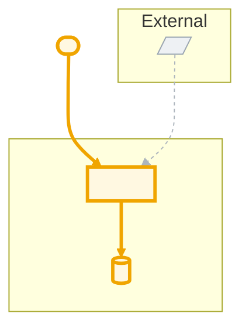

# Spec Playbook — template to build Software Architecture Labs

---

## Build order and the correction rule  (read first)

**Precondition — `CONTEXT.md`.** The glossary is **built beforehand by the
author, not by this playbook.** It is a frozen reference input to every step
below and is never edited to make an evaluation pass. If a generated file needs a
term the glossary lacks, that is a defect in the generated file, not in
`CONTEXT.md`.

Produce the remaining files in this exact order. Each step gates the next.

1. **`Users/<Persona>.md`** — one per persona (§2).
2. **`README.md`** — the domain-context spec (§3), written using only
   `CONTEXT.md` vocabulary.
3. **`Eval-Spec.md`** — the rubric (§4), written **from `README.md`** and the
   persona files. Never written or adjusted after a score is known.
4. **`Eval-Results.md`** — run `Eval-Spec.md` against `README.md` (§5). Iterate:
   - **When an iteration is not favourable, correct `README.md` and nothing
     else.** Do not edit `CONTEXT.md` (the author's input), `Eval-Spec.md`,
     `REDALE.md`, `Architecture-Diagram.md`, the persona files, or the criteria.
     If a fix appears to need another file, the real defect is in `README.md` — it
     used a term the glossary never defined, claimed something the personas do not
     support, contradicted itself — so fix it *there*.
   - Re-run. Repeat until the verdict is **PASS** (overall ≥ threshold, no
     `[CRITICAL]` failing, every persona block above its bar).
   - Record every iteration in `Eval-Results.md`: the score, the
     `README.md`-only change made, and the re-run result.
5. **`REDALE.md`** — only after `Eval-Results.md` shows PASS. Built on the passed
   `README.md`.
6. **`Architecture-Diagram.md`** — last. Built on `CONTEXT.md`, the passed
   `README.md`, and `REDALE.md`.

Never generate step 5 or 6 before step 4 reaches PASS. If `README.md` changes
after 5 or 6 already exist, re-derive them from the new `README.md`.

The only edits outside `README.md` allowed during the eval loop: an outside
change forces a reference repair (a file was deleted or renamed), or the user
explicitly directs another file to change. Both are logged in `Eval-Results.md`
as out-of-loop edits.

---

## 1. Which files must exist

```
root/
|── CONTEXT.md             domain context, glossary terms — BUILT BY THE AUTHOR beforehand; input only, never generated or edited here
├── Users/
│   ├── <Persona1>.md      one per user. Role, needs, pains, criteria
├── README.md              use CONTEXT.md to write specs
├── Eval-Spec.md           Evaluator' of README.md
├── Eval-Results.md        the evaluator's run against the spec: score and gaps
├── REDALE.md              requirements, estimations, data model, api design, etc
└── Architecture-Diagram.md mermaid code for architecture proposal
```

---

## 2. `Users/<Persona>.md`

One per persona, same skeleton:

```markdown
# <Name> — <Job title>

## Role
What they do in the system, in three or four lines.

## A day in their work
The typical path, in steps. This is where flows the spec was missing turn up.

## Needs
- Needs … in order to …

## Current pains
- "…" ← verbatim quote where you have one; otherwise the pain phrased as they would say it

## What the system gives them
- …

## Associated acceptance criteria
D1, D4, X2 …  ← the §11 IDs, so the document navigates in both directions
```

four to nine personas is the sensible range. Consider external actors as well.

---

## 3. `README.md` — domain context

Purpose: One deliverable. User CONTEXT.md to complete these sections.

Sections:

| # | Section | What goes in it |
|---|---|---|
| 1 | Summary | What the system is, in five to eight lines. No marketing adjectives |
| 2 | Problem | The real pains, quoting the user verbatim wherever you have the quote |
| 3 | Objective | Four to six numbered objectives, each one attacking pains from users |
| 4 | Out of Scope | What's excluded **and why**. An exclusion without a reason reads as an oversight |
| 5 | Key Product Concepts | The nouns of the domain, defined |
| 6 | Users and Their Needs | Summary table plus links into `/Users` |
| 7 | Key Product Decisions | The decisions, each with its reasoning. This is where architectural judgement shows |
| 8 | Expected User Experience | What each role sees. Written as checkable claims |
| 9 | Main Flows | The full lifecycle, numbered, naming the role responsible for each step |

Write this one in the language of the business. The spec is written in English (the
professor asks for it), but the interface and the glossary keep the real vocabulary:
*cuota*, *cronograma*, *acta de conformidad*, *mora*.

---
## 4. `Eval-Spec.md`

Purpose: a **repeatable rubric that scores `README.md`** (§3). It is run in §5
(`Eval-Results.md`). Write it *before or alongside* `README.md`, never after the
score is known.

Keep the original intent: **overall criteria** for the document as a whole, plus
**specific per-persona criteria**, one set for every file in `Users/` (§2).

### Scoring model

- All criterion must be between 0-10.
- Every criterion is **binary — PASS (1) / FAIL (0)**. No half marks: if a reader
  would still have to guess, it is a FAIL.
- State a **threshold** up front (e.g. "≥ 8 / 10 overall **and** no CRITICAL
  failing").
- Judge only what is **written** in `README.md` (plus `CONTEXT.md` where README
  explicitly defers to it). Intent in your head does not count.
- Mark some criteria **[CRITICAL]** — a fail there blocks progress regardless of
  the total (e.g. "the problem is stated", "each objective attacks a real pain").
- If the score is low, **fix `README.md`, never soften the criterion** (see §5).

### Criterion format

Every criterion uses the same fields so §5 and the §11 acceptance criteria can
point back at it:

```markdown
### <ID> — <short name>   [CRITICAL?]
- Checks: <the single thing this verifies>
- PASS:   <the exact condition that earns the point>
- FAIL:   <what a miss looks like>
- Where:  <README section(s) to read>
```

Stable IDs: `O#` for overall, `<PersonaInitials>#` for per-persona (e.g. `CL1`
for a Client persona).

### A. Overall criteria (starter set — adapt per lab)

| ID | Checks |
|---|---|
| O1 | All §3 sections present and non-empty; business vocabulary from `CONTEXT.md`, no `_Avoid_` synonyms |
| O2 | **Problem** is explicit and stands on its own — *what* hurts and *why it is hard* — with verbatim user quotes where available **[CRITICAL]** |
| O3 | Every **Objective** is numbered and traces to a named pain in §2 or a persona **[CRITICAL]** |
| O4 | Every **Out of Scope** item carries a reason, not just a name |
| O5 | **Key Product Concepts** define every domain noun used later in the document |
| O6 | **Key Product Decisions** each state the alternatives considered and why this one won |
| O7 | **Expected User Experience** is written as checkable claims, one set per role |
| O8 | **Main Flows** are numbered and every step names the responsible role |
| O9 | No contradiction between sections (scope vs flows vs decisions) |
| O10 | Every acceptance-criteria ID referenced in the document actually exists in §11 |

### B. Per-persona criteria (repeat for each `Users/<Persona>.md`)

| ID pattern | Checks |
|---|---|
| `<P>1` | Each **Need** in the persona file is answered by a §3 objective, decision, or flow |
| `<P>2` | Each **Current pain** is visibly addressed — trace it to the text that resolves it |
| `<P>3` | The persona's **"day in their work"** path is fully covered by §9 Main Flows |
| `<P>4` | The persona's **Associated acceptance criteria** exist, are testable (number / count / binary), and are reachable from §11 |
| `<P>5` | External personas only: portal scoping, per-company data isolation, and permissions are stated |

### Output contract

`Eval-Spec.md` ends with an **empty scoring worksheet** — all IDs listed, blank
verdict/note columns, a total line, the threshold, and a
`PASS → proceed / FAIL → revise README.md` verdict line — that §5 fills in.

---

## 5. 'Eval-Results.md'

The evaluator's run based on 'Eval-Spec.md' criteria. Structure:

- Overall score and score per persona.
- Criterion-by-criterion table: `ID | verdict | evidence | gap`.
- The criticals, separately and first.
- Iteration history: what was fixed between runs.

If the score comes back low, **do not soften the criterion** — fix README.md. A criterion
watered down so it passes is exactly what the exercise is designed to catch.

Fix **only `README.md`** during the loop — see *Build order and the correction rule*
above. Editing `CONTEXT.md`, `REDALE.md`, or any other file to make the eval pass
is a process error; if it happens, revert it and re-do the correction in
`README.md`.

---
## 6. `REDALE.md`

Requirements in the **Lewis System Design** framework, worked strictly top-down.
**R.E.D.A.L.E.** = **R**equirements · **E**stimate · **D**esign the services ·
d**A**ta model · **L** Components · **E** Scale.

In this playbook `REDALE.md` holds **only R, E, D and A**:

- **L — Components** — the iteration diagrams that wire the services together —
  belongs in `Architecture-Diagram.md` (§7), not here.

### Rules

- **Work the letters in order; each builds on the previous one.** The Estimate
  consumes the Requirements' parameters; the Storage math consumes the §A data
  model; the services in D realise the requirements in R.
- **No component or deployment diagram and no wiring detail** — that is §7. `D`
  names services and their responsibilities in prose and tables only.
- Every requirement and every parameter is **verifiable**: a reviewer says PASS
  or FAIL without a follow-up question.
- Reuse `CONTEXT.md` vocabulary exactly.
- Stable IDs the other files cite: `R#` requirement (one flat list — behavioural
  and quality requirements together, the id does not encode the type), `P#`
  parameter, `SVC-<Name>` service; entities are cited by name.
- Show every calculation. A number with no derivation is a FAIL.

### R — Requirements

| Sub-section | What goes in it |
|---|---|
| **Problems to solve** | The real pains, grouped **by actor** — one short list per persona in `Users/` (§2). Quote the user verbatim where you have it. |
| **Requirements** | **One flat list — no split, and no type in the id.** Every item is `R#`, numbered in one sequence. |
| **Parameters** | A table of every concrete value the requirements above depend on: thresholds, validity windows, limits, code formats, funding order, retention, targets. `P#`. If `Eval-Spec.md` also lists these, **that file is the source of truth** and this table mirrors it. |

#### Writing an `R#` — actor, action, outcome, not an artifact list

A requirement is not "the system has a KYC module" — that names a component,
not a requirement. Write it as an interaction: **who does what, under what
condition, with what observable result.** Prefer this shape:

```
As <actor/role>, the system must <verifiable behaviour>, so that <outcome/why>.
```

- **Name the actor** — the persona from `Users/`, an external system, or "the
  system" only for a background/automated behaviour that no human triggers.
- **Name the trigger or condition** — the step in a Main Flow (§9) or state
  transition (§A) this requirement fires on. If you cannot point to a flow
  step or a state transition it belongs to, the requirement is probably
  actually describing an artifact, not a behaviour — rewrite it or cut it.
- **State the observable result**, in terms a tester can check without
  opening the implementation: a value that changes, a message the actor
  receives, a state the entity moves to, a condition that must always hold.
- Bad (artifact-shaped): *"KYC verification module."*
  Good (interaction-shaped): *"Before creating a remittance, the system must
  run a KYC check on the sender and block the transaction with a clear reason
  if it fails, so the sender is never left wondering why the transfer did not
  go through."*
- Bad: *"Notification service."*
  Good: *"When a remittance changes state, the system must notify the
  recipient within P# minutes, so they know money is on the way without
  polling the app."*

The list must still contain **both kinds**: behaviours the system performs in
response to an actor or an event, written this way, **and** quality
attributes written as checkable claims from the actor's point of view (e.g.
"A sender never sees the same remittance charged twice, even if they retry
the payment"). One capability or one quality claim per bullet; each testable.
Across the list, make sure the usual quality attributes are all covered —
consistency, availability, performance, security, auditability, scalability —
none silently missing.

Every `R#` should trace to a persona's Need/pain (§2), a step in a Main Flow
(§9), or a quality claim in Expected User Experience (§3.8) — if it traces to
none of these, it is not yet a requirement, it is an implementation note; move
it to §D or drop it.

An `R#` requirement that cannot be verified, names a component instead of a
behaviour, or a parameter left "TBD", is a FAIL.

### E — Estimate

Size the system from first principles. The load and server figures are the
concrete form of the scalability / availability requirements in R — keep them
consistent.

| Sub-section | What goes in it |
|---|---|
| **Inputs** | Table: `input | value | where it comes from`. Anchor scale to a real-world reference (an incumbent) and cite it. Every guess is labelled an assumption. |
| **Load** | Writes/s and reads/s, **average and peak** (state the peak factor). Separate the request classes (writes, status reads, session / quote / auth). Give the total peak. |
| **Servers** | From a stated per-core throughput, derive the server count; add N+1 redundancy and regions; then name the **real bottleneck** (often the database, not CPU). |
| **Storage** | Per-transaction footprint computed **from the §A data model** — one row per record type: `count | size each | subtotal`. Then per day, per year, and retention × copies. Reference-data size noted separately. |

### D — Design the services

The **logical** services only — no wiring, no diagram (that is §7). Group them by
lifecycle phase, one table per phase:

```markdown
#### <Phase — e.g. "Creating the remittance">
| Service | What it does |
|---|---|
| <Name> Service | <single responsibility, one or two lines> |
```

Typical phases (adapt to the domain): access & identity · create the core
entity · move the money / do the work · deliver or pay out · status & closing ·
administration & exceptions · notifications · **external systems** (own table,
clearly marked).

Rule: one service = one responsibility. If its description needs the word "and"
twice, split it.

### A — Data model

Conceptual-to-logical. **No DDL**, but attribute-level tables are expected.

| Part | What goes in it |
|---|---|
| **Entities** | One table per entity: `Attribute | Data type`. Concrete types (`decimal(14,2)`, `enum: …`, `string(120)`). Mark `unique`, `masked`, "empty until …", and append-only ("written once and not modified afterwards"). |
| **State machine** | For the central entity: the list of states (final ones marked), then a transition table `From | To | Trigger`. States with **no exit** are called out explicitly. |

Every reference-style attribute points to an entity defined in this section.
Every state named in an `R#` requirement or a `P#` parameter appears in the state
machine.

---

## 7. `Architecture-Diagram.md`

**Mermaid code only**, deriving the architecture from `CONTEXT.md`, `README.md`,
and `REDALE.md`. One primary `flowchart`; add a `sequenceDiagram` for the main
happy path only if ordering needs it.

### Rules

- **The happy path(s) are highlighted *inside* the diagram** (via `classDef` +
  `linkStyle`) — never split out into a separate prose section.
- Every **node** traces to one of: a service in `REDALE` D (`SVC-<Name>`), an
  entity / data store in `REDALE` A, an actor from `README` §6 / `Users/`, or an
  external system from `REDALE` D's external-systems table. No node that is none
  of these.
- Every **Main Flow** (`README` §9) appears as a connected chain of edges.
- Every `R#` that describes an ordered sequence is a traceable chain of edges;
  every path a critical quality requirement depends on (consistency,
  single-payout, audit) is visible.
- Show **trust boundaries** (subgraphs), **external systems**, and **data
  stores** (distinct shape).
- Node and edge labels match `CONTEXT.md` exactly — no `_Avoid_` synonyms.

### Styling convention

| Meaning | Style |
|---|---|
| Primary happy path (nodes + edges) | thick, accent colour (e.g. gold) |
| Secondary / alternate path | dashed, second colour (e.g. blue) |
| Supporting element, not on any path | grey / muted |
| External system | distinct fill + shape (`[/ /]`) |
| Data store | cylinder shape (`[( )]`) |

### Skeleton



Open the file with a short **Legend** mapping every colour and shape to its
meaning.

### Validation checklist (all must be true before this deliverable is done)

- [ ] The Mermaid block renders in a live editor.
- [ ] Every node is a `REDALE` D service, a `REDALE` A entity/store, a
      `README` §6 actor, or a named external system; no orphan nodes.
- [ ] Every §9 Main Flow is a traceable chain of edges.
- [ ] Each happy path is visually distinct from the rest of the graph.
- [ ] Every ordered `R#` and every critical quality requirement's path is
      visible on the diagram.
- [ ] Trust boundaries, external systems, and data stores are all shown.
- [ ] All node and edge labels use `CONTEXT.md` terms only.

---